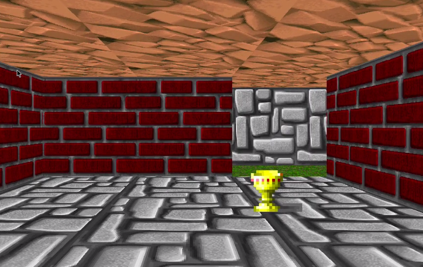
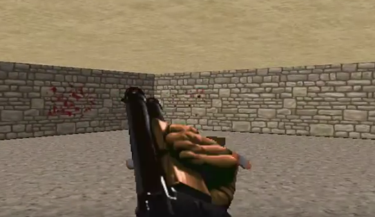

# wolf3d (UNIT)
It is my third graphic project.
The aim of the project is to create your own version of Wolfenstein 3D..

### Subject: [wolf3d.en][1]

### Requirements
- linux or macos
- installed minilibx
- libx11-dev and libxext-dev for linux
- framework OpenGL and framework AppKit for mac

### How does it work?
	make
	./wolf3d

[1]: https://github.com/vtiterin/wolf3d/blob/master/wolf3d.en.pdf
